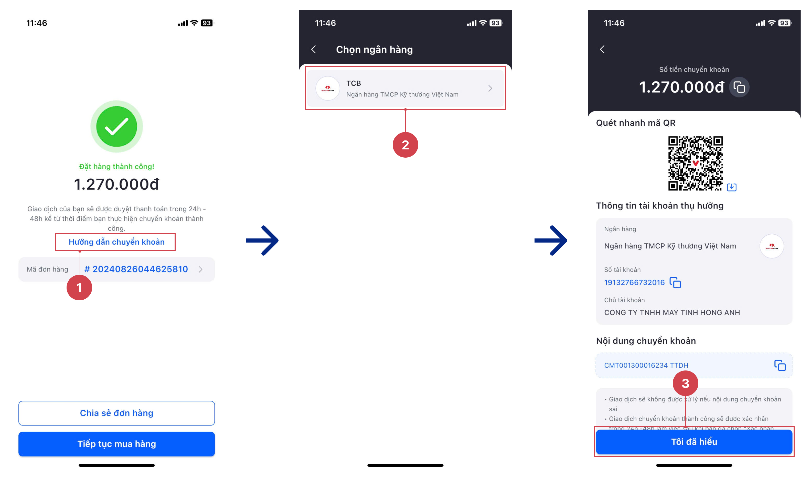

# Mua lại đơn hàng

### Các cách mua lại đơn hàng

Bạn hoàn toàn có thể thực hiện mua lại đơn hàng theo 2 cách sau:

1. Mua lại tại ngay màn danh sách các đơn hàng&#x20;
2. Mua lại ngay khi xem chi tiết đơn hàng.

Để thực hiện mua lại đơn hàng, bạn vui lòng thực hiện theo các cách sau:

<figure><figcaption>
Mua lại đơn hàng 1
</figcaption></figure>

### Lưu ý

* Ngay khi thực hiện mua lại đơn hàng, hệ thống ngay lập tức tạo lại cho bạn 1 giỏ hàng chứa tất cả các thông tin về sản phẩm và các thông tin khác tương tự như đơn hàng bạn đã mua.
* Nếu bạn đang có 1 sẵn 1 giỏ hàng khác, hệ thống sẽ cần bạn xác nhận lựa chọn giỏ hàng nào trước khi thực hiện mua hàng lại:
  * Lựa chọn 1: Chọn "**Đóng**" khi bạn không muốn cấp nhật lại giỏ hàng hiện tại.
  * Lựa chọn 2: chọn "**Xác nhận**" nếu bạn muốn thay thế giỏ hàng hiện tại thành giỏ hàng chứa các thông tin của đơn hàng mà bạn đang muốn mua lại.

<figure><figcaption>
Mua lại đơn hàng 2
</figcaption></figure>
